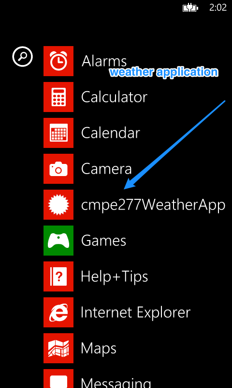
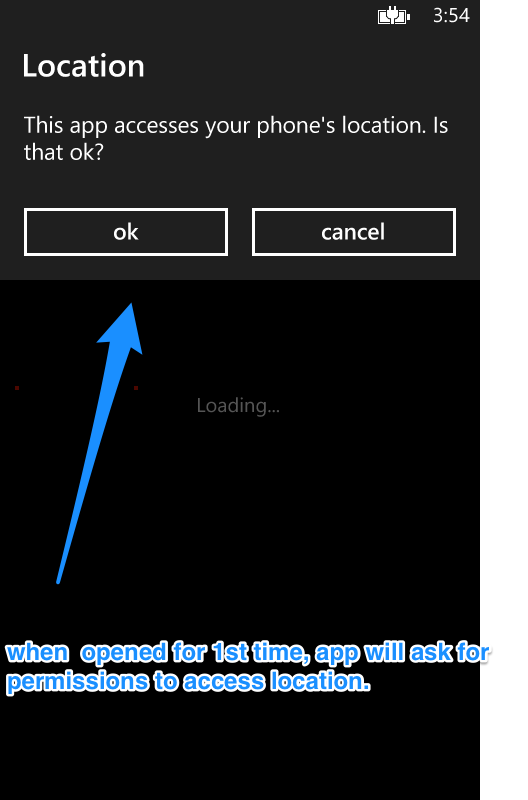
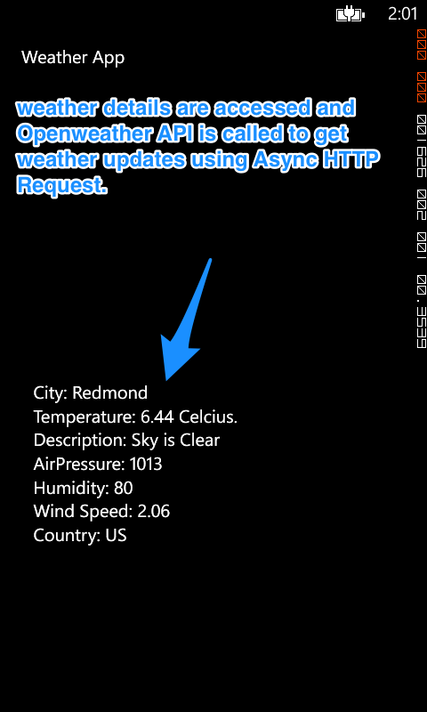
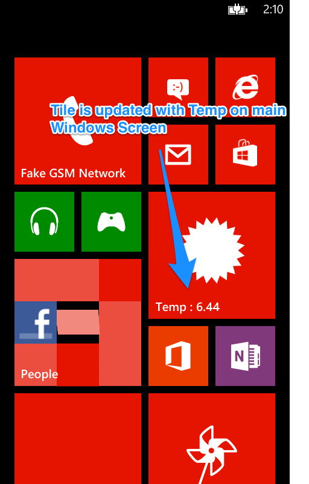

cmpe277WindowsPhoneWeatherApp
=============================

This is an individual assignment given in class CMPE 277 - SmartPhone Application Development 

Following are the features of the App: 

1. App Identifies the current location of the Mobile. 
2. On Basis of Latitude &amp; Longitude it call Open Weather API to get details about weather using Async HTTP callback functionality 
3. Parse JSON response and display it on the textview 4.Presenlty it have a Azure Mobile Services integration to update LIVE Tiles ( this will be removed / won't work since I have trail version of Azure account)

ScreenShots
=============

